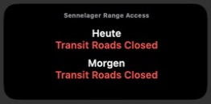

# Scriptable Sennelager Range Access Widget

Ein kompaktes iOS-Widget für [Scriptable](https://scriptable.app/), das die
veröffentlichten Öffnungs- und Schließzeiten der Sennelager Training Area für
heute und morgen anzeigt.

Das Script liest die Angaben direkt von
[bfgnet.de/sennelager-range-access](https://bfgnet.de/sennelager-range-access)
aus und stellt sie in einem mittleren Widget dar.

## Screenshot

Echte Scriptable-Vorschau:

## Anzeige

- **Rot:** „closed“ beziehungsweise gesperrt
- **Orange:** Zeitangaben wie „from“, „until“ oder „between“
- **Grün:** „open“ beziehungsweise geöffnet
- Beim Antippen des Widgets öffnet sich die ursprüngliche Webseite.

## Installation

1. Installiere **Scriptable** auf dem iPhone.
2. Erstelle in Scriptable ein neues Script.
3. Kopiere den Inhalt von
   [`sennelager-range-access-widget.js`](sennelager-range-access-widget.js)
   vollständig hinein und speichere das Script.
4. Starte es einmal direkt in Scriptable.
5. Füge ein mittleres Scriptable-Widget zum Home-Bildschirm hinzu und wähle
   das gespeicherte Script aus.

## Daten und Hinweise

Das Script ruft die öffentliche Sennelager-Webseite in einer Webansicht auf
und liest daraus die Tabellenzeilen für heute und morgen. Änderungen an der
Webseite oder ihrer HTML-Struktur können daher eine Anpassung des Scripts
erforderlich machen.

Dieses Projekt steht in keiner Verbindung zum Betreiber der Webseite oder zu
den britischen Streitkräften. Prüfe vor Ort zusätzlich die offiziellen
Hinweise und Beschilderungen.
