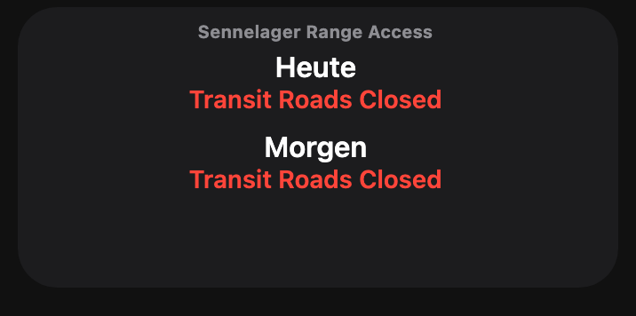
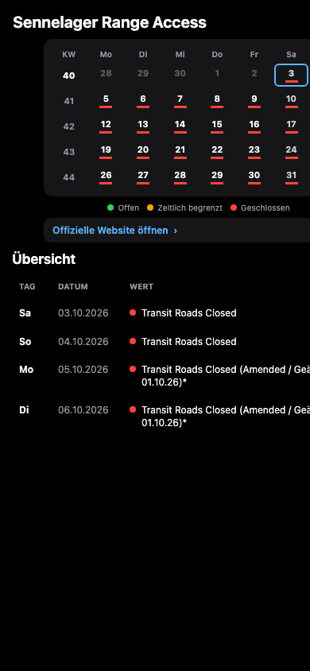

# Sennelager Range Access Widget

Ein Scriptable-Widget für die aktuellen Zufahrtsinformationen des Truppenübungsplatzes Sennelager.

## Verhalten

- Das Widget selbst entspricht der ursprünglichen GitHub-Version und zeigt die Einträge für heute und morgen.
- Beim normalen Start des Skripts erscheint ausschließlich die Widget-Vorschau.
- Erst ein Tipp auf das platzierte Widget öffnet fünf Kalenderwochen mit KW-Nummern sowie einer Liste mit Tag, Datum und Originalwert.
- Die Kalendertage sind grün (offen), orange (zeitlich begrenzt) oder rot (geschlossen) markiert.
- Der Kalender ist als kompakte Tabelle mit einer KW-Spalte und fünf Wochenzeilen aufgebaut. Die Statusfarbe erscheint nur als Linie unter der Tageszahl.
- Kalender, Legende und Quellenlink stehen fest; nur die Werteliste ist scrollbar.
- Die Liste zeigt unabhängig vom Fünf-Wochen-Kalender alle auf der Website gefundenen Einträge ab heute.
- Ein Tipp auf einen Kalendertag mit Daten scrollt die Liste zum passenden Eintrag.
- Ausschließlich der heutige Tag ist im Kalender blau eingerahmt.
- Tageszellen und Listeneinträge werden ohne einzelne Rahmen oder Karten dargestellt.
- Die Detailansicht verwendet eine einzeilige Überschrift ohne zusätzlichen KW-Bereich.
- Die Detailansicht ist schwarz und schlicht, ohne Farbverläufe.

## Installation

1. `sennelager-range-access-widget.js` öffnen und den gesamten Inhalt kopieren.
2. In Scriptable ein neues Skript anlegen und den Inhalt einfügen.
3. Ein Scriptable-Widget auf dem Home-Bildschirm hinzufügen.
4. In den Widget-Einstellungen dieses Skript auswählen.

Die Daten stammen weiterhin von `https://bfgnet.de/sennelager-range-access` und werden beim Ausführen aktuell geladen.
Der Abruf folgt dem Originalprojekt: Die Seite wird in einer Scriptable-`WebView` geladen und die Zeilen aus `.com-content-article__body tr` werden über ihre `td`-Zellen ausgelesen.

## Screenshots

### Widget

### Kalenderansicht

